# Hey, I'm Hayatu

Software Engineer who builds scalable interfaces, integrates AI into real products, and ships clean, user-focused experiences.

<!-- Stats SVGs: refresh via Actions workflow "Update README stats". Set repo variable README_STATS_BASE_URL to your self-hosted https://github.com/anuraghazra/github-readme-stats deployment (no trailing slash). -->
 

## What I use

- **Frontend:** TypeScript, React, Vue, Next.js, Nuxt, Tailwind CSS  
- **Backend:** Node.js, Express/Fastify, REST, GraphQL  
<!-- - **AI/LLMs:** OpenAI, RAG, embeddings, agent workflows -->

## My values

- Clear and direct communication  
- Delivering on time  
- Writing clean and maintainable code  

## What I build

<!-- - RAG and LLM tools for real business needs -->
- Modern frontends for fintech, e-commerce, AI platforms and more  
- Fast backend APIs  

**Email:** hayatusanus.dev@gmail.com  
**Learn more about me:** https://hayatusanusi.xyz
